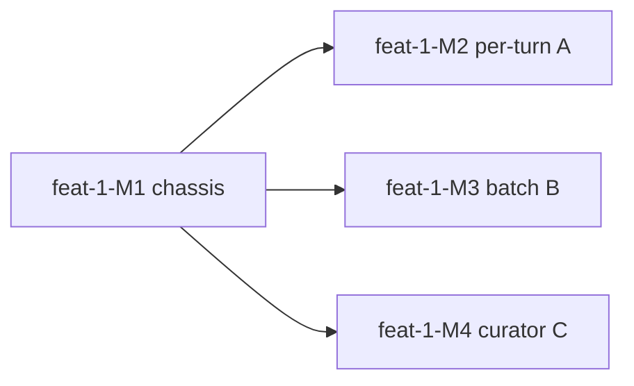

# feat-1: Claude Code 上的部门级 Skill 自进化 IT 解决方案 — 技术方案

> 对齐: spec.md v1

> Unit branch: `unit/feat-1` (will be created by orchestrator)

## Changelog

<!-- 按时间倒序追加。格式：YYYY-MM-DD (Mx): 一句话 — 详见 Mx/progress.md -->

## 现状分析

> 本仓（`self-evolution/skill-evolution/`）是全新方案空间，没有既有产品代码可嵌。所以"现状"= 我们要构建在其上的 **Claude Code 集成面（改不了的部分）** + **6 个参考工作各自能搬来用的层**。下面四子段就按这个口径写。

### 涉及范围

本 unit 的代码会落在一个**新建的 Claude Code 插件 + 本地常驻 worker 进程**里（详见架构总览）。它要嵌进 CC 的两个我们改不了、只能旁挂的接口面：

- **CC hook 事件面**（只读、旁挂）：`SessionStart` / `UserPromptSubmit` / `PreToolUse` / `PostToolUse` / `Stop` / `SessionEnd`。hook 通过 stdin 收到 JSON（含 `session_id` / `transcript_path` / `cwd` / `tool_name` / `tool_input` / `tool_response` 等），通过 stdout 返回 `{"continue":true,...}`。**hook 有超时（claude-mem 实测配 60–120s），且会阻塞主循环——重活绝不能在 hook 里跑。**
- **CC 轨迹面**（只读）：会话以 JSONL 持续追加写在 `~/.claude/projects/<encoded-cwd>/<session-id>.jsonl`。这是我们挖"共性问题/重复纠偏"的唯一数据源。
- **CC skill 面**（读写自己的那份）：skill 是 `<dir>/SKILL.md`（YAML frontmatter + Markdown body），CC 从 `~/.claude/skills/` 与项目 `.claude/skills/` 自动加载。**v1 我们只读写"本用户那份拷贝"**，不碰内置/插件 skill。

### 既有约束

来自"改不了 CC 内核"这一根本前提，以及 spec.md 的范围决策：

1. **hook 必须秒回**：所有 LLM 级分析（review / minibatch reflection / curator）必须甩给常驻 worker 异步做，hook 只投递事件。（claude-mem 的硬教训）
2. **没法 fork CC 的 agent loop**：Hermes 的 Per-turn Review 是在它自己的 agent loop 里加计数器 + fork 子 agent。我们在 CC 外，**只能用 `PostToolUse` 计数 + `Stop` 触发**来重建这套语义，review/optimizer agent 用 **headless `claude -p` / Claude Agent SDK 子进程**来跑（skill-creator 的 `run_loop.py` 已用 `claude -p` 做 description 优化，是同款先例）。
3. **纯个人级、单机、隐私隔离**（spec Q7/Q11）：v1 全部状态本地化，每用户一份 worker + 一份存储，不上中心服务端，个人轨迹/skill 改动对他人不可见。
4. **完全静默 + 不降级体验**（spec Q6 + 验收"不变慢"）：worker 在后台跑，不向成员输出任何东西，不得引入可感知延迟。
5. **自动落盘 + 可逆**（spec Q1）：所有改动自动生效，但必须可回滚——这要求每次改动前快照。
6. **在线、无标注集**（spec Q3）：不存在 SkillOpt 那种可重放打分的 held-out 验证集，**不能照搬它的验证门**；要用"持续轨迹流自纠 + 拒绝缓冲"替代。

### 可复用能力

逐个参考工作，能直接搬来当地基的部分（这就是本方案的"轮子库"）：

| 来源 | 直接复用的东西 | 用在哪 |
|---|---|---|
| **claude-mem** | ① hook 当瘦分发器 + 常驻 worker 的拆分架构；② 增量 tail JSONL（`fsWatch`+offset 持久化，只读新行）；③ 自带 SQLite 存储；④ supervisor 监督进程存活；⑤ MCP server 回灌通道 | M1 chassis 整体范式 |
| **Hermes** | ① Per-turn Review 的触发语义（iteration 计数→turn 末 review）；② `skill_manage` 的 patch（fuzzy 局部替换）/ edit / write_file 语义 + 写坏安全扫描即回滚；③ Curator 的 archive-not-delete / 30天stale/90天archive / pinned跳过；④ provenance 区分 seed vs agent-created | M2 (A) / M4 (C) / SkillStore |
| **auto-dream** | ① 多重门控（时间门 + session 量门 + 锁 + 节流）；② "input 全部 skill + 窄读轨迹"的装配；③ 相对日期转绝对、删被推翻事实的整理纪律 | M3 (B) 的调度与装配 |
| **SkillOpt** | ① minibatch reflection：success/failure 轨迹**分桶**、各跑 analyst 找**共性**（非单次）；② 结构化 `Edit{op,target,content,support_count,source_type}`；③ ranking 选 top-L（有界编辑/text learning rate，默认 L=4）；④ rejected-edit buffer 当负反馈；⑤ `<!-- SLOW_UPDATE_START/END -->` 保护区 | M3 (B) 的提炼引擎 + SkillStore 保护区 |
| **Codex prompt** | ① 资产化门槛（≥2 次 / 输入稳定 / 有明确输出 / 未被覆盖）；② "reuse-before-create"；③ 重复 workflow → 新建 skill 的判定 | M3 (B) 的新建-skill 判定 |
| **skill-creator** | 冷启动：draft→eval→improve 闭环、description "pushy"防欠触发、progressive disclosure、`scripts/improve_description.py` | 冷启动（部门侧一次性，**非本 unit 主体**，仅引用） |

> **关键复用洞察**：SkillOpt 的 `Edit.support_count`（一条 edit 被多少条轨迹支持）天然就是 Codex 的"≥2 次门槛"的量化实现——B 层把两者合一：minibatch analyst 产出带 support_count 的 edit，ranking 只接受 support_count ≥ 阈值的，既挖共性又防垃圾。

### 相关历史

- 本仓 `notes/hermes-agent-features/`（01–05）已有 Hermes per-turn / curator / provenance 的代码级深挖笔记，是 M2/M4 的直接依据。
- 本仓 `notes/2026-04-13-self-evolution-three-projects.md`：三项目 fitness 信号对比。
- `CLAUDE.md` 方法论铁律：**代码逻辑 + 业务逻辑必须同时讲**——本 design 的每条决策都给"解决什么问题"+"靠哪个机制"。

---

## 架构总览

**一句话**：装一个 CC 插件，hook 把事件秒投给一个本地常驻 worker；worker 旁读 JSONL 轨迹，用三套机制（实时/批量/维护）调一个 headless 子 agent 去改"本用户那份 skill"，全程静默、自动落盘、每改必快照可回滚。

```
┌──────────────────────────── 用户的 Claude Code（改不了，只旁挂）────────────────────────────┐
│  正常对话/工具调用  ──写──►  ~/.claude/projects/<enc>/<sid>.jsonl  （轨迹，只读取）            │
│        │                                                                                       │
│  hook 事件（瘦分发，秒回）                                                                      │
│   SessionStart / UserPromptSubmit / PostToolUse(*) / Stop / SessionEnd                          │
└─────────┼──────────────────────────────────────────────────────────────────────────────────┘
         │ 投递事件（unix socket / 事件日志），立即返回 {"continue":true}
         ▼
┌──────────────────────────── 本地常驻 worker daemon（重活全在这，每用户一份）─────────────────┐
│  EventRouter ─► SessionState(每会话 iter 计数, 处理 offset)                                     │
│       │                                                                                         │
│       ├─[A 实时] Per-turn Review     触发: iter≥阈值 且 Stop                                     │
│       │      窄读当前 session 轨迹 ─► headless review agent(Hermes prompt) ─► SkillStore.apply  │
│       │                                                                                         │
│       ├─[B 批量] Batch Optimizer     触发: auto-dream 门控(≥Xh + ≥N session)                    │
│       │      多 session 轨迹 ─► success/failure 分桶 ─► analyst(找共性,带 support_count)         │
│       │      ─► ranking 选 top-L ─► (缺领域知识?→MCP取) ─► SkillStore.apply/create               │
│       │      ─► 下一批自纠: 问题复发?→rollback + 入 rejected-edit buffer                          │
│       │                                                                                         │
│       └─[C 维护] Curator            触发: idle≥2h 且 距上次≥7天                                  │
│              看整库 ─► archive(stale)/merge(近重复)/dedupe ─► 维护 SLOW_UPDATE 保护区             │
│                                                                                                 │
│  SkillStore: read/apply(edits[])/create/archive/snapshot/rollback + 安全扫描 + provenance       │
│  McpKnowledge: 经 Agent SDK 挂【部门 MCP + 文档目录】，按缺口检索权威内容                         │
│  Storage(SQLite): provenance / snapshots / rejected_edits / evolution_log / session_state /     │
│                   workflow_observations / fitness_signals                                       │
│  Supervisor: 保活、单实例锁、崩溃重启                                                            │
└────────────────────────────────────────────────────────────────────────────────────────────────┘
         │ 改动直接落到 ~/.claude/skills/<name>/SKILL.md （本用户那份，CC 下个 turn 自动加载）
         ▼
   成员无感：skill 越用越准；坏改动下一批自纠/回滚；不通知、不变慢
```

**before/after 形态**：before = 部门下发一套种子 skill（skill-creator 造，一次性），每人一份拷贝，之后是死的；after = 装上本插件后，那份拷贝在后台按本人用法持续演化。

---

## 关键决策

### 决策 1: 部署形态 = CC 插件(hooks) + 本地常驻 worker daemon，每用户一份

- **选择**：插件只放 hook（瘦分发）；所有逻辑在一个本地常驻 worker 进程，单机、每用户独立。
- **理由**：CC 内核改不了，hook 是唯一旁挂点；hook 有超时且阻塞主循环，重活必须异步 daemon（claude-mem 已验证这条路可行）。纯个人级 + 隐私（spec Q7/Q11）要求本地化。
- **拒绝**：纯 hook 内联（超时/阻塞/拖慢，违反"不降级体验"）；中心化服务端（v1 个人级、部门未必有中心基建、隐私成本高，且这是"部门级更新方案"才需要的，已推迟）。
- **风险**：daemon 保活/崩溃恢复需 supervisor；多 CC 窗口并发需单实例锁。

### 决策 2: per-turn 触发用 `PostToolUse` 计数 + `Stop` 触发来重建 Hermes 语义

- **选择**：worker 为每个 session 维护 `iters_since_skill` 计数；每个 `PostToolUse` +1；turn 末（`Stop`）若计数≥阈值（默认 10）则触发一次 A 层 review，触发后归零。
- **理由**：Hermes 在自己 agent loop 内做这件事，我们在 CC 外没法插进它的 loop；`PostToolUse`（每次工具调用触发）+ `Stop`（turn 末触发）正好等价重建。
- **拒绝**：改 CC 主循环（不可能）；纯靠定时（会丢"当下这段对话刚学到的东西"的即时性，那是 B 层的活）。
- **风险**：CC 若并发子 agent，`PostToolUse` 计数要按 `session_id`(+`agentId`) 分桶，避免串话。

### 决策 3: 轨迹读取 = 增量 tail JSONL（offset 持久化）+ 窄读

- **选择**：worker 记每个 jsonl 的已处理 offset（存 `session_state`），只读新追加行；analyst 阶段对长轨迹按 `_MAX_TRAJ_CHARS`(~12k) 截断（沿用 SkillOpt）。
- **理由**：claude-mem 的 FileTailer 模式 + auto-dream"不整文件读"——多人多 session 持续增长，必须增量。
- **拒绝**：每次全量重读（慢、贵、重复分析）。
- **风险**：jsonl 被 CC 压缩/轮转时 offset 失效，需按 size 回退检测重置。

### 决策 4: edit 提炼引擎 = SkillOpt minibatch reflection（B 层），A 层用 Hermes 自由 review

- **选择**：**A 层**（单 session、实时）直接用 Hermes 风格自由 review prompt——读当前对话，自主决定 patch/create，轻量。**B 层**（多 session、挖共性）用 SkillOpt：success/failure 分桶 → 各跑 analyst 找**共性模式**（非单次）→ 产出带 `support_count` 的结构化 `Edit` → ranking 选 top-L。
- **理由**：A 只看一个人一次对话，没有"共性"可言，结构化反而是负担；B 看一批轨迹，必须结构化聚合才能区分"通用程序错误"vs"偶发"。这正是用户原话"他怎么从一批轨迹中提炼修改 skill 值得借鉴"。
- **拒绝**：A 也上 minibatch（杀鸡用牛刀，且单 session 凑不出 minibatch）；B 用 Hermes 自由 review（挖不出量化共性，易被单次噪声带偏）。
- **风险**：两套 prompt/路径要维护；A 与 B 可能对同一 skill 都想改 → 用 SkillStore 串行锁 + 快照避免互踩。

### 决策 5: 在线"验证门"= 快照 + 下一批轨迹自纠 + rejected-edit buffer（替代 SkillOpt 的 held-out gate）

- **选择**：不设离线打分门。每次 edit 前快照；改动直接生效；**B 层每次跑时回看**——上次为某失败模式打的补丁，这批轨迹里该模式是否仍复发/是否出现回归；复发或回归 → `rollback` 到快照 + 把该 edit 写进 `rejected_edits`（下次 analyst 带它当负反馈，别再犯）。
- **理由**：在线无标注集、无法重放 rollout（spec Q3 + 既有约束 6）。"持续真实轨迹流"就是验证集；SkillOpt 的 rejected-edit buffer 是现成的负反馈机制。
- **拒绝**：SkillOpt held-out gate（离线才有）；人工审批门（spec Q1 已定全自动）。
- **风险**：自纠有滞后（要等下一批）——靠 A 层即时安全扫描 + 有界编辑把单次伤害压到最小；"问题是否复发"的判定需要稳定的失败模式指纹（见接口段 `fitness_signals`）。

### 决策 6: 有界编辑 + SLOW_UPDATE 保护区

- **选择**：每次运行的 edit 数有预算 L（A 层默认 1–2，B 层默认 4，对齐 SkillOpt `learning_rate:4`）；skill 内 `<!-- SLOW_UPDATE_START/END -->` 之间是保护区，只有 Curator(C) 能在维护时改，A/B 的 analyst prompt 明令不得动（沿用 SkillOpt analyst 原文约束）。
- **理由**：text learning rate 防一次改飞；保护区放"长期避坑铁律"，不被高频小改冲掉。
- **拒绝**：无界自由改（skill 会被冲垮，尤其 MCP 知识注入容易灌一大篇）。
- **风险**：预算太小可能要多轮才补齐——可接受，宁慢勿乱。

### 决策 7: MCP 知识注入 = 触发在轨迹、内容在 MCP、落盘写"引用+摘要+provenance"

- **选择**：review/optimizer agent 经 Agent SDK 挂【部门 MCP + 文档目录】只读工具。**只有当轨迹暴露出"缺领域知识/反复手动粘贴"的缺口时**，agent 才带着该缺口去检索；写进 skill 时优先**写引用链接 + 关键摘要 + 来源/日期 provenance**，而非死拷整段正文。
- **理由**：spec Q9 要求 v1 就做；知识库会漂移，死拷会过期（auto-dream"相对→绝对、删被推翻事实"同款教训）。触发与内容分离避免"没缺口也乱灌"。
- **拒绝**：把知识库正文整段固化进 skill（过期、撑爆 skill）；无触发地主动灌知识（噪声）。
- **风险**：MCP 不可达时必须降级跳过、不报错（spec 验收 Scenario "MCP降级"）；检索内容的权威性依赖知识库本身质量。

### 决策 8: skill 落盘位置 + provenance（seed vs agent-created）

- **选择**：本用户 skill 库就在 CC 的加载路径（`~/.claude/skills/`）；`skill_provenance` 标记每个 skill 是 `seed`（部门下发的拷贝）还是 `agent-created`（系统新建）。**所有 skill 都可被 patch（个性化）**；但 **Curator 只 archive/merge `agent-created`，永不动 `seed` 文件本体**（即便用户少用也保留，因为它是部门祝福的）。
- **理由**：直接落 CC 加载路径 → 下个 turn 自动生效，无需回灌通道（v1 静默，连通知都不要，更不需要注入展示）。provenance 是 Curator 安全的前提（Hermes 不变量）。
- **拒绝**：独立目录 + 软链（多此一举）；不区分 seed（Curator 可能误删部门种子）。
- **风险**：用户手动建的 skill 也算一类——v1 等同 `agent-created` 之外的"user-created"，Curator 同样不动（保守）。

### 决策 9: review/optimizer/curator agent = headless `claude -p` / Agent SDK 子进程，受限工具白名单

- **选择**：三套机制要"思考"时，都起一个 headless 子 agent（`claude -p` 或 Agent SDK），system prompt = 对应机制的 prompt（A=Hermes review / B=SkillOpt analyst+ranking / C=curator+slow_update），工具白名单 = SkillStore 读写 + MCP 只读，**禁危险 Bash/网络**（对齐 Hermes `_bg_review_auto_deny`）。
- **理由**：等价替代 Hermes 的 fork 子 agent；skill-creator `run_loop.py` 已用 `claude -p` 做过同类事，是先例。
- **拒绝**：在 worker 里手写 LLM 调用拼 prompt（失去 agent 的工具使用/检索能力，MCP 注入就做不动）。
- **风险**：子进程成本/并发要限流（单用户串行跑足够）；要继承/命中 prompt cache 以省钱（Hermes 实测降 ~26%）。

### 决策 10: 三机制并存的触发不互踩

- **选择**：A 走 `Stop`+计数；B 走独立调度器（auto-dream 门控，按时间/量，不挂 `Stop`）；C 走 idle 探测。三者对 SkillStore 的写经**单写锁 + 快照**串行化。
- **理由**：spec Q10 三机制全上；不同入口避免抢同一 hook；写锁防并发改坏同一 skill。
- **拒绝**：全挂 `Stop`（B/C 的重活会拖慢 turn 末）。
- **风险**：极端情况下 A 改了、B 紧接着基于旧快照分析——用写锁内"读最新"消解。

---

## 接口与数据流

> 只写"长什么样、谁调谁"，不写行级实现。

### 1) hook → worker 事件（瘦分发）

每个 hook 命令做的事：读 stdin JSON → 投递一条事件到 worker（unix domain socket，连不上则 append 到 `events.ndjson` 由 worker tail）→ 立即输出 `{"continue":true,"suppressOutput":true}` 退出。事件类型：

```
{ "kind": "session_start|user_prompt|tool_use|turn_end|session_end",
  "session_id": "...", "cwd": "...", "transcript_path": "...",
  "tool_name": "...", "ts": <epoch>, "agent_id": "<if subagent>" }
```
（`tool_use` 不带大 payload，只带 `tool_name` 等元信息用于计数/信号；正文留给 worker 去 jsonl 窄读。）

### 2) worker 内部模块边界

- `EventRouter`：分发事件；维护 `SessionState`。
- `SessionState`：`{session_id → {iters_since_skill, last_offset, last_user_msg}}`。
- `TrajectoryTailer.read_new(session_id) -> list[TrajItem]`：按 offset 增量读 jsonl，归一成 analyst 可读结构（对齐 SkillOpt `fmt_trajectory` 的两种格式）。
- `ReviewAgentA.run(session_id)`：装配当前 session 轨迹 + 当前 skill 列表 → headless review。
- `BatchOptimizerB.run()`：门控通过后，取一批 session 轨迹 → 分桶 → analyst → aggregate/ranking → 应用 → 自纠回看。
- `CuratorC.run()`：全库维护。
- `SkillStore` / `McpKnowledge` / `FitnessTracker` / `Storage`。

### 3) SkillStore 操作（借 Hermes skill_manage + SkillOpt Edit）

```
read(name) -> SkillDoc
list() -> [{name, provenance, last_used, patch_count, pinned}]
apply(name, edits: [Edit]) -> Result      # 先 snapshot，再按 op 改，再安全扫描；扫描 fail 自动回滚
create(name, content) -> Result           # 标记 provenance=agent-created
archive(name) / rollback(name, snapshot_id)
```
`Edit`（直接采用 SkillOpt 结构）：
```
{ op: "append"|"insert_after"|"replace"|"delete",
  target: "<锚点精确文本>", content: "<markdown>",
  support_count: <int>, source_type: "failure"|"success" }
```
- `apply` 对 `insert_after/replace/delete` 用 fuzzy 锚点匹配（Hermes `fuzzy_find_and_replace`），不匹配返回 preview 让 agent 自纠。
- `apply` 拒绝任何落在 `<!-- SLOW_UPDATE_START/END -->` 内的 target（除非调用方是 Curator）。

### 4) B 层数据流（核心，最值得讲）

```
门控通过(auto-dream式: now-last_run≥Xh 且 新session数≥N)
  → 取最近一批 session 的新轨迹（TrajectoryTailer）
  → 按结果分桶: failure 桶 / success 桶（结果信号见下"轨迹打标"）
  → 切 minibatch(默认 8/批) → 各跑 analyst_error / analyst_success
       产出 patch{edits:[Edit(support_count,source_type)]}
  → aggregate 跨 minibatch 合并(failure 优先) → ranking 选 top-L(=4)
       且只保留 support_count≥2 的 edit（= Codex ≥2 次门槛）
  → 缺领域知识的 edit → McpKnowledge.fetch(缺口) → 改写成"引用+摘要+provenance"
  → 重复 workflow 检测(workflow_observations 计数≥2 且未被现有 skill 覆盖) → SkillStore.create
  → SkillStore.apply(...)
  → 自纠回看: 对上轮已 apply 的 edit，检查其针对的失败指纹这批是否仍复发/回归
       复发或回归 → rollback + 写 rejected_edits（下轮 analyst 注入为负反馈）
```

**轨迹打标（success/failure 怎么定，在线版）**：无 ground-truth label，用启发式信号——同一 session 内的用户**纠偏/重做/否定语**（"不对/重来/不是这样/应该用X"）、工具调用**报错后重试**、任务被**放弃**记为 failure 侧；顺利完成、无返工记为 success 侧。该信号也用于 A 层即时判断与 `fitness_signals` 的"复发"判定。（这是在线对 SkillOpt 离线 `RolloutResult.hard/soft` 的替代，写实在 M3。）

### 5) Storage（SQLite，每用户一份）

| 表 | 关键列 | 作用 |
|---|---|---|
| `skill_provenance` | name, origin(seed/agent/user), pinned, created_at | Curator 安全边界 |
| `skill_snapshots` | name, snapshot_id, content, ts, edit_ref | 回滚 |
| `rejected_edits` | skill, edit_json, reason, ts | 负反馈缓冲（SkillOpt buffer） |
| `evolution_log` | mechanism(A/B/C), skill, edits, evidence, result, ts | 审计（管理员侧未来用） |
| `session_state` | session_id, iters_since_skill, last_offset | 触发计数 + 增量读 |
| `workflow_observations` | signature, count, last_seen, example_refs | Codex 重复-workflow 门槛 |
| `fitness_signals` | failure_fingerprint, skill, first_seen, last_seen, status | 复发判定/自纠 |

### 6) review-agent 调用契约

headless 子 agent：`system` = 机制 prompt；`allowed_tools` = SkillStore.* + MCP(只读)；`input` = 轨迹切片 + 当前 skill 列表（+ B 层附 rejected_edits 负反馈 + meta-skill 指导）；继承主 session 的 prompt cache 前缀（省钱）。危险命令自动 deny。

---

## 契约层增量 (delta-spec)

- **no spec delta**：本仓是研究/方案空间，**无 `docs/specs/<包>/` 长青行为契约层**（那是 nano-multiagent 的结构）。本 unit 的对外行为契约即 `spec.md` 的【验收标准】本身；不另立 delta-spec 文件。

## 风险与回退

| 风险 | 应对 / 回退 |
|---|---|
| **改坏 skill 拖累用户**（最核心风险） | 三重兜底：A 层 apply 后安全扫描 fail 即回滚；每改必快照可 `rollback`；B 层下一批自纠 + rejected_edits 防再犯。验收 Scenario "改坏不长期生效"由此覆盖。 |
| **worker 拖慢 CC**（违反"不变慢"） | hook 秒回（决策1/2）；worker 限流串行；analyst 轨迹截断；子 agent 命中 prompt cache。降级路径：worker 挂掉时 hook 投递失败即静默跳过，CC 正常用（claude-mem fallback 模式）。 |
| **垃圾 skill 污染库** | Codex ≥2 次门槛 + support_count≥2 + 一次性不造（验收 Scenario）；Curator 周期 archive/merge。 |
| **MCP 知识库不可达/过期** | 不可达→跳过不报错（验收 Scenario "MCP降级"）；过期→写引用而非死拷 + provenance 标日期。 |
| **success/failure 打标不准**（在线无 label） | 启发式信号可能误判 → 用 support_count≥2 + 有界编辑限制单次误判影响；持续观察可在 M3 调权。 |
| **并发：多 CC 窗口 / 子 agent 串话** | worker 单实例锁；计数按 session_id(+agent_id) 分桶；SkillStore 单写锁。 |
| **jsonl 轮转/压缩致 offset 失效** | 按文件 size 回退检测，size 变小则重置 offset 重读。 |
| **回滚本身**（整个 unit 撤回） | 插件可一键卸载（移除 hooks.json 注册）；worker 停止；skill 库可从快照恢复到任一历史点；seed skill 始终保留原始拷贝。 |

## Runbook for Reviewer

> 本 unit 的常驻服务 = 每用户一个 worker daemon。reviewer 验收时按下表重启，确保跑的是最新二进制。（命令为本方案设计意图，具体名以 worker CLI 实现为准。）

| 服务 | 停止命令 | 启动命令 | 健康检查 |
|---|---|---|---|
| skill-evo worker daemon | `skillevo daemon stop` | `skillevo daemon start` | `skillevo daemon status`（返回 pid + 已处理事件数 + 各机制 last_run） |

> 无其它常驻依赖（无 DB 服务/MQ；SQLite 是嵌入式文件）。reviewer 走旅程前先 `daemon stop && daemon start`。

## Milestones

> 拆 4 个的举证（§4.2）：① **工作量**远超单 worker 窗口（插件+daemon+存储+三机制+MCP，远 >800 行/>10 文件）；② **分阶段验证**：M1 chassis 必须先对着真实 CC hook/jsonl 验通，M2–M4 才有真实数据可跑；③ **模块独立可并行**：三套机制是不同触发入口 + 各自 mechanism 模块，M1 冻结后可并行。M2–M4 共享的只是 M1 的 SkillStore/Storage（只读调用），各自范围不交集。

| ID | 标题 | 依赖 | 并行组 | 范围 | 退出标准 |
|---|---|---|---|---|---|
| feat-1-M1 | chassis | — | A | 插件 `hooks.json`(瘦分发) + worker daemon + supervisor + SQLite(全表 schema) + TrajectoryTailer(增量 tail) + SkillStore(read/apply/create/archive/snapshot/rollback + 安全扫描 + provenance + SLOW_UPDATE 保护区) + McpKnowledge 客户端骨架 | `[worker]` daemon 能收真实 CC hook 事件、增量 tail 一个真实 session jsonl、对一个 skill 完成 apply→snapshot→rollback 往返；安全扫描写坏能回滚；`[worker]` 单实例锁 + offset 持久化生效；`[reviewer]` 装上插件后正常用 CC 无可感知变慢、无任何输出打断（覆盖 Scenario:skill更新对成员静默 / 后台运行不拖慢日常使用） |
| feat-1-M2 | mechanism-A-perturn | M1 | B | A 层：PostToolUse 计数 + Stop 触发 + headless review agent(Hermes prompt) + 有界 patch + 即时安全扫描回滚 | `[reviewer]` 单 session 内成员反复做同类纠正后，同类任务不再需重复纠正（覆盖 Scenario:同类纠正被记住）；`[worker]` 计数达阈值(默认10)才触发、按 session 分桶、单次 edit≤L(默认1–2)、每改有快照 |
| feat-1-M3 | mechanism-B-batch | M1 | B | B 层：auto-dream 门控调度 + 批量轨迹分桶(success/failure 打标) + SkillOpt analyst(error/success)+aggregate+ranking(top-L) + support_count≥2 门槛 + 重复-workflow 新建 skill + MCP 知识注入(引用+摘要+provenance) + 下一批自纠 + rejected-edit buffer | `[reviewer]` 覆盖 Scenario:反复手动粘贴的部门知识被纳入 / MCP暂不可用降级不报错 / 重复多步流程变成skill / 一次性流程不被造skill / 证据不足不擅自改动 / 改坏的改动不长期生效；`[worker]` minibatch 分桶与 analyst 跑通、单次 apply≤L(默认4)、support_count<2 的 edit 被丢弃、rejected_edits 被写入并在下轮注入 |
| feat-1-M4 | mechanism-C-curator | M1 | B | C 层：idle≥2h 且 距上次≥7天触发 + 全库 archive(stale 30天)/merge(近重复)/dedupe + 只动 agent-created + SLOW_UPDATE 保护区维护(slow_update prompt) | `[reviewer]` 长期使用后 skill 库不膨胀成一堆窄重复 skill；seed skill 不被归档/删除；A 的进化不影响他人(覆盖 Scenario:个人进化彼此隔离 的本机隔离面)；`[worker]` 仅 agent-created 被 archive、from-never hard-delete、pinned 跳过、保护区只由本机制改 |


