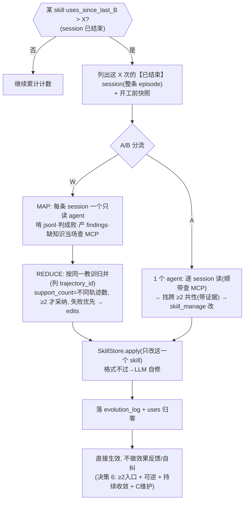
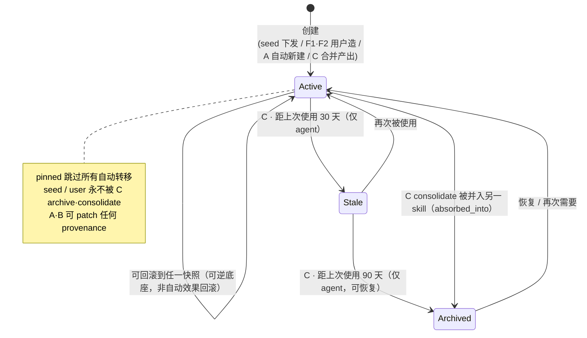
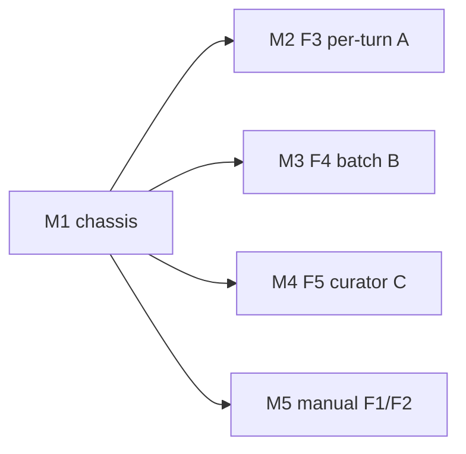

# feat-1: Claude Code 上的部门级 Skill 自进化 IT 解决方案 — 技术方案

> 对齐: spec.md v1（5 feature 版）

> Unit branch: `unit/feat-1` (will be created by orchestrator)

## Changelog

- **2026-06（B 深化 + 决策 E）**：B(F4) 重构为 **W/A 两套并行、A/B 上线对比**（决策 5）；确立**决策 E：在线不做效果反馈**（对齐 Hermes，删失败指纹自纠/复发回滚/rejected_edits，决策 6）；去改动数预算（决策 7）；MCP 注入前移到**逐轨迹/逐 session 读取时当场查**（决策 8）；轨迹**完整 episode 读、逐轨迹 agent 导航 jsonl、不开窗**（决策 4）；新增决策 15（≥2 是逼扎实的 LLM 判断、不代码核验）。引用底座扩充 Trace2Skill[07] + 决策记录[08] + W 设计[09] + A 主 prompt。细节与逐字 prompt 见 `research/`。


## 现状分析

> 本仓（`self-evolution/skill-evolution/`）是全新方案空间，没有既有产品代码可嵌。所以"现状"= 我们要构建在其上的 **Claude Code 集成面（改不了的部分）** + **6 个参考工作各自能搬来用的层**。
> **6 个参考源的实现级挖掘**（含逐字 prompt、success/failure 分流、各参数默认值）已沉在 `[research/](./research/)`（README + 01–06 + `prompts/`）。本节只做摘要，细节用 `[research/xx]` 引。

### 涉及范围

本 unit 的代码会落在**一个新建的 Claude Code 插件 + 一个本地常驻 worker 进程 + 一个本地轻 UI**（详见架构总览）。它嵌进 CC 的三个我们改不了、只能旁挂的接口面：

- **CC hook 事件面**（只读、旁挂）：`SessionStart` / `UserPromptSubmit` / `PreToolUse` / `PostToolUse` / `Stop` / `SessionEnd`。hook 经 stdin 收 JSON（含 `session_id` / `transcript_path` / `cwd` / `tool_name` / `tool_input` / `tool_response`），经 stdout 返回 `{"continue":true,...}`。**hook 有超时（claude-mem 实测 60–120s）且阻塞主循环——重活绝不能在 hook 里跑** [research/04]。
- **CC 轨迹面**（只读）：会话 JSONL 持续追加在 `~/.claude/projects/<encoded-cwd>/<session-id>.jsonl`。这是挖"共性问题/重复纠偏"的唯一数据源。**判定 session 是否已结束**（`SessionEnd` 收到 / 文件 mtime 静默足够久）是 B 的前置。
- **CC skill 面**（读写自己的那份）：skill = `<dir>/SKILL.md`（YAML frontmatter + Markdown body），CC 从 `~/.claude/skills/` 与项目 `.claude/skills/` 自动加载。**v1 只读写"本用户那份拷贝"**，不碰内置/插件 skill。

### 既有约束

1. **hook 必须秒回**：所有 LLM 级活（A review / B reflection / C curator / F2 distill）甩给 worker 异步，hook 只投递事件 [research/04]。
2. **没法 fork CC 的 agent loop**：Hermes per-turn 是在它自己 loop 里计数+fork；我们在 CC 外只能 `**PostToolUse` 计数 + `Stop` 触发** 重建，子 agent 用 **headless `claude -p` / Agent SDK** 跑（skill-creator `run_loop.py` 已用 `claude -p`，先例）[research/02][research/06]。
3. **纯个人级、单机、隐私隔离**（spec Q7/Q11）：全部状态本地化，每用户一份 worker + 一份存储，不上中心服务端。
4. **完全静默 + 不降级体验**（spec Q6 + 验收"不变慢"）：自动机制（A/B/C）后台跑、不输出、不引入可感知延迟。注意 **F1/F2 是用户主动触发、有 UI 交互**，不属"静默"范畴。
5. **自动落盘 + 可逆**（spec Q1）：改动自动生效，但每次改前快照可回滚。
6. **在线、无标注集**（spec Q3）：无 SkillOpt 那种可重放打分的 held-out 验证集、也无 gold。**不照搬其验证门、也不重建在线效果反馈**（对齐 Hermes，决策 6）——质量靠"入口 ≥2 + 可逆 + 持续收敛 + C 维护" [research/08 A5][research/01 §4]。
7. **只用已结束 session 做进化输入**（spec Q14）：进行中的会话轨迹不完整、成败未定，不纳入 B（也不纳入 F2 选择列表的"可用素材"）。

### 可复用能力


| 来源                | 直接复用的东西                                                                                                                                                                                 | 用在哪                                          | 细节            |
| ----------------- | --------------------------------------------------------------------------------------------------------------------------------------------------------------------------------------- | -------------------------------------------- | ------------- |
| **claude-mem**    | hook 瘦分发 + 常驻 worker；增量 tail JSONL（offset 持久化）；自带 SQLite；supervisor 保活；MCP 客户端；本地 UI 服务范式                                                                                               | M1 chassis                                   | [research/04] |
| **Hermes**        | per-turn 触发语义（计数→turn 末 review，**含自动新建**）；`skill_manage` patch/edit/create + 写坏即回滚；Curator archive-not-delete/30天stale/90天archive/pinned跳过/consolidate；**每个 skill 的使用计数**；provenance    | M2(A)/M4(C)/SkillStore                       | [research/02] |
| **auto-dream**    | "input 全部 skill + 窄读轨迹"装配；相对日期转绝对、删被推翻事实的整理纪律；锁/节流                                                                                                                                      | M3(B) 装配 + M4(C) 纪律                          | [research/03] |
| **SkillOpt**      | success/failure 意图分离；找跨轨迹**共性**（非单次）；`support_count`/失败优先 的**综合选择逻辑**；`<!-- SLOW_UPDATE -->` 保护区。（**不搬**：held-out gate、rejected buffer、edit 预算——决策 6/7） | M3(B·W) 综合阶段 + 保护区                    | [research/01] |
| **Trace2Skill**   | **per-task 逐轨迹深析** + Memory-Item 中间产物；**目录手术**（8 op + TRANSLATE + VERIFY + create↔链接配对 + 行数上限 + 进阶披露）；+Combined/+Success 实证。（**不搬**：agentic 重测 gold、3 seed） | M3(B·W) map + SkillStore apply | [research/07][research/09] |
| **Codex prompt**  | 资产化门槛（**≥2次**/输入稳定/有输出/未覆盖）；reuse-before-create；Skip 缺省；Do-NOT-capture；保守纪律                                                                                                                            | **F2 生成 prompt** + A/C 自动新建判定 + B 的 ≥2 门槛 | [research/05] |
| **skill-creator** | draft→eval→improve；description "pushy" 防欠触发；progressive disclosure；写 skill 质量纪律                                                                                                         | **F1**（从零造）+ 所有写 skill 的质量底座                 | [research/06] |


> **两个关键洞察**（来自 research）：
> ① **SkillOpt 是单 skill × 单任务域**——它默认"这批轨迹都在练同一个 skill" [research/01 §"单skill前提"]。我们靠 **B 按单 skill 使用计数触发**（决策3）天然满足这个前提：触发时只看这一个 skill 的轨迹，**不需要额外的"按 skill 归因分组"外循环**。
> ② **"反复=共性"靠跨轨迹判定**：W 里 `support_count` = **综合阶段**归并后该教训的**不同 trajectory_id 数**，`<2` 丢弃；A 里靠 prompt 逼 agent 列出 ≥2 段证据。**≥2 是逼扎实的 LLM 判断、不代码核验**（决策 15）；SkillOpt 原本的 ranking/edit 预算我们**不用**（决策 7）。

### 相关历史

- 本仓 `notes/hermes-agent-features/`（01–05）：Hermes per-turn/curator/provenance 代码级笔记，M2/M4 直接依据。
- 本 unit `research/`：6 源实现级挖掘 + 逐字 prompt，是 design 每条决策的事实底座。
- `CLAUDE.md` 铁律：**代码逻辑 + 业务逻辑同时讲**。

---

## 架构总览

**一句话**：装一个 CC 插件——hook 把事件秒投给本地常驻 worker；worker 旁读已结束的 JSONL 轨迹，跑三套自动进化机制（A 实时 / B 单skill批量 / C 维护）调 headless 子 agent 改"本用户那份 skill"；另有一个本地轻 UI 供用户主动创建 skill（F1 从零 / F2 选会话沉淀）。**B 同时实现 W/A 两套、A/B 上线对比**。全程自动部分静默、自动落盘、每改必快照可回滚；**在线不做效果反馈（决策 6），质量靠 入口≥2 + 可逆 + 持续收敛 + C 维护**。

```
┌──────────────── 用户的 Claude Code（改不了，只旁挂）────────────────┐
│ 正常对话/工具 ──写──► ~/.claude/projects/<enc>/<sid>.jsonl（轨迹，只读）│
│      │ hook 事件（瘦分发，秒回）                                       │
│  SessionStart / UserPromptSubmit / PostToolUse(*) / Stop / SessionEnd  │
└──────┼─────────────────────────────────────────────────────────────────┘
       │ 投递事件（socket / 事件日志），立即返回 {"continue":true}
       ▼
┌──────────────── 本地常驻 worker daemon（重活全在这，每用户一份）────────────────┐
│ EventRouter ─► SessionState(每会话 iter 计数, offset) + SkillUsage(每skill使用计数)│
│   │                                                                                │
│   ├─[F3·A 实时] 触发: iter≥10 且 Stop                                              │
│   │     窄读当前 session ─► headless review(Hermes prompt) ─► SkillStore.apply/create│  ← 可改可新建
│   │                                                                                │
│   ├─[F4·B 单skill批量] 触发: 某 skill 自上次 B 后被用 >X 次（仅已结束 session）      │
│   │     取该 skill 的这 X 个【完整已结束 session】= ROLLOUT，A/B 分流两套实现:        │
│   │     W: 逐轨迹只读agent深析(判成败+findings,缺知识当场查MCP)→综合(≥2/失败优先)→edits│
│   │     A: 一个agent(逐session读+查MCP+找≥2+skill_manage改)                          │
│   │     ─► SkillStore.apply(只改这一个 skill；不做效果反馈/自纠——决策6)              │  ← 只改不建
│   │                                                                                │
│   └─[F5·C 维护] 触发: idle≥2h 且 距上次≥7天                                         │
│         看整库 ─► archive(stale)/consolidate(合并，含新建)/dedupe ─► 维护保护区       │  ← 可新建(合并)
│                                                                                    │
│ SkillStore: read/apply/create/archive/snapshot/rollback + 目录手术 + provenance      │
│ McpKnowledge: 经 Agent SDK 挂【部门 MCP + 文档目录】，逐轨迹读取时按缺口当场检索       │
│ Storage(SQLite): provenance/snapshots/evolution_log(含variant W/A)/session_state/    │
│                  skill_usage                                                         │
│ Supervisor: 保活/单实例锁/崩溃重启                                                   │
└──────┬───────────────────────────────────────────────────────────┬─────────────────┘
       │ 改动直落 ~/.claude/skills/<name>/SKILL.md（下个 turn 自动生效）│ 调用同一 SkillStore
       ▼                                                            ▲
   自动部分成员无感：skill 越用越准，坏改动可回滚              ┌────┴─── 本地轻 UI（用户主动触发）──┐
                                                          │ [F1 从零造] skill-creator 向导    │
                                                          │ [F2 选会话沉淀] 列已结束session→  │
                                                          │   勾选+输入意图→Codex式蒸馏→skill │
                                                          └───────────────────────────────────┘
```

**before/after**：before = 部门用 F1(skill-creator) 造种子 skill、每人一份拷贝；after = 装上插件后，那份拷贝在后台按本人用法持续演化（A/B/C），用户也能随时主动造新 skill（F1/F2）。

### 运行时事件时序（凸显"hook 秒回 + 异步重活"）

> 关键看点：**hook 永远立即返回 `{continue:true}`，CC 不被阻塞**；所有 LLM 级重活都在 hook 返回之后、由 worker 异步 spawn 子 agent 完成。A 由 `Stop` 触发；B 不挂 hook、由 worker 调度器按"单 skill 使用计数"触发；C 由 idle 触发。

```mermaid
sequenceDiagram
  participant CC as Claude Code
  participant H as Hook(瘦分发)
  participant W as Worker daemon
  participant Sub as headless 子agent
  participant SK as ~/.claude/skills/*.SKILL.md

  Note over CC,W: 一次正常 turn（多次工具调用）
  loop 每次工具调用
    CC->>H: PostToolUse(tool_name…)
    H->>W: 投递 tool_use 事件
    H-->>CC: {continue:true} 秒回
    W->>W: iters_since_skill++ ; skill_usage++
  end

  CC->>H: Stop(turn 结束)
  H->>W: 投递 turn_end
  H-->>CC: {continue:true} 秒回
  Note over W,Sub: ↓ 以下全在 hook 返回之后异步发生，不阻塞 CC
  alt iters_since_skill ≥ 10 (触发 A)
    W->>Sub: spawn(Hermes review prompt + 当前 session 轨迹)
    Sub->>SK: SkillStore.apply / create（先快照→安全扫描）
    Sub-->>W: 完成
  end

  Note over W,Sub: B —— 不由 hook 触发，worker 调度器轮询；W/A 两套按分流
  W->>W: 某 skill uses_since_last_B > X 且其 session 已结束?
  alt 分到 W
    W->>Sub: spawn(逐轨迹只读 agent 深析 ×N → 综合)
  else 分到 A
    W->>Sub: spawn(单 agent: 读+找≥2+skill_manage 改)
  end
  Sub->>SK: SkillStore.apply（只改这一个 skill；不做效果反馈/自纠）

  Note over W,Sub: C —— idle≥2h 且 距上次≥7天
  W->>Sub: spawn(curator + slow_update)
  Sub->>SK: archive / consolidate / 维护保护区
```

---

## 关键决策

### 决策 1: 部署形态 = CC 插件(hooks) + 本地常驻 worker + 本地轻 UI，每用户一份

- **选择**：插件只放瘦 hook；自动逻辑在常驻 worker；F1/F2 用户交互走一个本地轻 UI（由 worker 起的本地服务，或 CLI/slash-command 降级）。全单机、每用户独立。
- **理由**：CC 内核改不了，hook 是唯一旁挂点且会超时阻塞→重活必须 daemon [research/04]；纯个人级+隐私要求本地化；F1/F2 需要"列会话+勾选+输入"的交互，需一个界面。
- **拒绝**：纯 hook 内联（超时/拖慢）；中心服务端（v1 个人级、隐私、属"部门级更新方案"已推迟）。
- **风险**：daemon 保活需 supervisor；多 CC 窗口需单实例锁；UI 仅本地监听（不对外）。

### 决策 2: A(F3) 触发 = `PostToolUse` 计数 + `Stop`，重建 Hermes per-turn（含自动新建）

- **选择**：worker 按 `session_id` 维护 `iters_since_skill`；每 `PostToolUse` +1；`Stop` 时 ≥10 触发 A，A 动了 skill 后归零。A 用 Hermes `_SKILL_REVIEW_PROMPT`，**可 patch 也可 create**（识别到可复用流程时新建）[research/02 §3.1]。
- **理由**：没法插进 CC 的 loop，用 hook 等价重建 Hermes 计数语义。
- **拒绝**：改 CC 主循环（不可能）；纯定时（丢即时性，那是 B 的活）。
- **风险**：并发子 agent 时计数按 `session_id(+agent_id)` 分桶。

### 决策 3: B(F4) 触发 = 单个 skill 的使用计数 > X 次，且只取已结束 session（核心改动）

- **选择**：worker 为每个 skill 维护"自上次 B 以来被用过几次"的计数（`skill_usage`）。某 skill 计数 > X（默认建议 X≈20，可调，上线观察）→ 取这 X 次用到它的、**已结束** session（**完整 episode，不开窗**，决策 4）当作**这一个 skill** 的 ROLLOUT 批，跑 B 的 W/A 流程（决策 5）。跑完计数归零。
- **理由**：① 天然满足"单 skill × 单任务域"前提，**省掉"按 skill 归因分组"的外循环**——触发即锁定一个 skill [research/01]；② 把进化绑定到 skill 的真实使用量，证据足才动；③ 用户明确要这个设计（spec Q14）。
- **拒绝**：auto-dream 式"时间+session量"周期门（跨 skill 混合批，违背单 skill 前提）；用进行中 session（轨迹不完整、成败未定，spec Q14）；开窗切片（丢后段成败/纠偏，决策 4）。
- **风险**：① "某 skill 被用了"的信号要可靠识别（skill 内容是否注入本 session）——见接口 `skill_usage` 来源；② 一个 session 用到该 skill 即整条进池（由逐轨迹 agent 自己在 episode 内聚焦相关部分，不预先切片）。

### 决策 4: 轨迹读取 = 增量 tail JSONL（offset 持久化）+ 已结束判定 + **逐轨迹完整读，不开窗**

- **选择**：worker 记每个 jsonl 的 offset（`session_state`）增量读 [research/04]；**只有已结束 session 才进 B 的池**（`SessionEnd` 或 mtime 静默阈值）。B 分析时**以完整 session（episode）为单位**——不在 skill 调用处开窗切片（成败/纠偏信号常在 episode 后段）[research/08 B2]；轨迹大/噪，由**逐轨迹 agent 用只读工具导航 jsonl**（grep + 读、屏蔽噪声），不是把全文 inline [research/08 B3/W3][research/03 auto-dream]。
- **理由**：claude-mem FileTailer + auto-dream"大 jsonl 自己 grep"；完整 episode 才有成败信号；spec Q14 只用已结束 session。
- **拒绝**：在 skill 调用处开窗（丢后段纠偏/成败）；全文 inline 截断（塞不下、噪声大）；用活跃 session。
- **风险**：jsonl 轮转/压缩致 offset 失效→按 size 回退重置；agent 漏读→prompt 强制覆盖每条 + 教训带 ≥2 证据引用。

### 决策 5: B 的提炼引擎 = **W / A 两套并行，A/B 上线对比**（框架取自 SkillOpt + Trace2Skill）

- **选择**：B 同时实现**两套方案**，质量基地相同（决策 6/16），用**真实使用 A/B 对比**择优 [research/08 W7]：
  - **W（Workflow / map-reduce）**：每条已结束 session 派一个**只读 agent 深析**(判成败 + 产 Memory-Item 式 findings，Trace2Skill per-task 结构去 gold) → **综合**(SkillOpt aggregate：按"同一教训"归并、`support_count`=不同轨迹数、**≥2 才采纳**、失败优先) → 产结构化 edits。详见 [research/09]。
  - **A（Agent / 一段 prompt）**：fork 一个 agent，给 [主 prompt + `skill_manage` + 只读工具 + MCP]，它在一个回合里读、找 ≥2 共性、改。主 prompt 详见 [research/prompts/agent-b-master-prompt.md]。
- **两套共同纪律**：找**跨 ≥2 会话共性**（非单次，逼带证据引用）、失败优先、generalizable 不 hardcode、reuse-first、按脆弱度调自由度、Do-NOT-capture（环境失败/对工具负面断言/已自愈瞬时错/一次性叙事）。**B 只改触发的那一个 skill、不新建**。
- **拒绝**：SkillOpt 的 minibatch（W 用 per-task 求单轨迹深度，[research/08 W1/W2]）；ranking 的改动数预算（见决策 7）；B 里塞新建（归 A/C/F2，决策 11）；独立打标步（成败折进逐轨迹深析，[research/08 W1]）。
- **A(F3) 与 B(F4) 的分工**：A=单 session 实时自由 review（Hermes per-turn）；B=单 skill 跨会话批量找共性（本决策两套）。

### 决策 6: 在线**不做效果反馈**（对齐 Hermes，替代离线 gate）—— 决策 E

- **选择**：最成熟的在线方案 Hermes **刻意不衡量"改动有没有效"**（usage 只记次数、Curator 只按时间衰减、A 改完不回头看）[research/02 一手]。我们**跟随**：**删掉**失败指纹比对 / 复发回滚 / outcome-driven `rejected_edits` / "下批自纠"。在线质量靠四样——① **入口 ≥2 证据门槛**（只在跨会话反复才改）② **可逆**（每改前 `curator_backup` 式快照 + archive 不硬删 + provenance 护 seed/user）③ **持续进化自然收敛**（坏改动若未解决真实需求，用户后续再产证据，下轮继续朝它改）④ **C 周期维护** [research/08 A5][research/01 §4]。
- **理由**：在线无可重放 held-out / 无 gold；四个参考没一个在线做效果反馈；山寨离线 gate 是错的。
- **拒绝**：held-out gate / agentic 重测 gold（离线）；失败指纹自纠 + rejected buffer（离线 gate 的山寨，**本决策的前一版即此，已废**）；人工审批（spec Q1）。
- **风险（接受，记观察点）**：判错的坏改动若不再被新证据触发会滞留——靠改动有界（危害小）+ ≥2 闸（少出坏改动）+ 可逆 + C 维护缓解；**W/A A/B 对比 + O 段观察点**持续监测 [research/08 D]。

### 决策 7: 不设改动数预算；保留大小上限 + SLOW_UPDATE 保护区

- **选择**：**不设"每轮最多改 K 处"的预算**——跟随 Hermes 的 be active（设预算是为了防 agent 避险不改，反而有害），限流交给 **≥2 入口门槛**[research/08 B6]。保留：SKILL.md<500 行 / 每 reference<300 行（Trace2Skill）、additive-first / minimal-patch、`<!-- SLOW_UPDATE_START/END -->` 保护区（只有 C 维护时改，A/B 明令不动）[research/07][research/01 §5]。
- **理由**：Hermes 无改动预算且催 be active；SkillOpt 的 `learning_rate` 是离线 learning-rate，不合身。
- **拒绝**：SkillOpt 式 edit budget L（已废）；无界（靠大小上限 + ≥2 + additive 控）。

### 决策 8: MCP 知识注入 = **在逐轨迹/逐 session 读取时检测 + 当场查**，落盘写"引用+摘要+provenance"

- **选择**：A/B/F2 的 agent 挂【部门 MCP + 文档目录】只读工具。**缺部门知识的信号藏在单条轨迹里**（用户手动粘内部资料 / agent 猜部门约定被纠正），到综合阶段就丢了 → **在逐轨迹深析（W 的 MAP）/ 逐 session 读取（A 的 Step 1）当场检测 + 带具体情境查 MCP**，把引用+摘要+来源/日期 provenance 嵌进 finding/note；综合/编辑阶段优先用已查到的 + 兜底 [research/08 W5/WA1][research/09]。
- **理由**：spec Q9 v1 就做；当场查避免"需要/有没有"两步错配；知识库会漂移→写引用+日期非死拷（auto-dream 纪律）。
- **拒绝**：整段固化；留到综合才查（信号已丢、易错配）；无触发主动灌。
- **风险**：MCP 不可达→降级跳过不报错（spec Scenario "MCP降级"）；N 个逐轨迹 agent 可能重复查→可缓存。

### 决策 9: skill 落盘 + provenance（seed / agent / user 三态）

- **选择**：本用户 skill 库就在 CC 加载路径（`~/.claude/skills/`）；`skill_provenance` 标 `seed`（部门下发拷贝）/ `agent`（A/C/B 自动产）/ `user`（F1/F2 用户造）。**所有 skill 都可被 patch（个性化）**；**Curator 只 archive/consolidate `agent`，不动 `seed`/`user` 本体**（Hermes 不变量）[research/02 §3.4]。
- **理由**：直落加载路径→下个 turn 生效，无需回灌（v1 静默）；provenance 是 Curator 安全前提。
- **风险**：consolidate 跨 provenance 时（把 agent skill 合进 user skill？）默认不跨，保守。

### 决策 10: 自动机制的"思考" = headless `claude -p` / Agent SDK 子进程，受限工具白名单

- **选择**：A/B/C/F2 要思考时起 headless 子 agent，system=对应机制 prompt，工具白名单=SkillStore + MCP(只读)，禁危险 Bash/网络（对齐 Hermes `_bg_review_auto_deny`），继承主 session prompt cache 省钱 [research/02 §3.2]。
- **理由**：等价替代 Hermes fork；skill-creator `run_loop.py` 先例。
- **风险**：成本/并发限流（单用户串行够）。

### 决策 11: 新建 skill 的分工 —— A/C 自动按需 + F1/F2 用户主动；B 不建

- **选择**：**A**（session 内识别可复用流程，受证据门槛）、**C**（consolidate 合并相近 skill）会**自动新建**；**F1**（从零向导）、**F2**（选会话沉淀）是**用户主动新建**入口；**B 只优化触发的那一个 skill、不新建**。
- **理由**：Hermes per-turn/curator 本就会建（spec Q13 更正）；B 按单 skill 触发，职责是精修该 skill。
- **拒绝**："自动绝不新建"（错，违背 Hermes 本性）；"B 里挖重复 workflow 建新 skill"（归 F2，避免 B 既修又建职责混）。
- **风险**：A/C 自动新建可能造垃圾→证据门槛（≥X 次/稳定/未覆盖，Codex 纪律 [research/05]）+ Curator 定期清理。

### 决策 12: F2 = 用户选已结束 session + 一段意图 → Codex 式一次性蒸馏成 skill

- **选择**：UI 列出该用户**已结束**的 session（带摘要）→ 用户勾选若干 + 输入意图 → worker 起 headless 子 agent，用 **Codex 式一次性自蒸馏 prompt**（中译见 [research/05]）读那几段 jsonl，产出候选 skill → 经 skill-creator 写作纪律成形 → 落盘（provenance=user）。
- **理由**：spec Q13/F2；Codex 一次性设计的正位用法（人触发、跨指定 session、产一个 skill）[research/05]。
- **拒绝**：把这套塞进自动 B（节奏/触发都不对）。
- **风险**：用户选的 session 可能噪声大→prompt 保守纪律 + 让用户确认候选再落盘。

### 决策 13: F1 = 集成 skill-creator（从零造），不重造

- **选择**：F1 直接复用/包装 skill-creator 的 draft→eval→improve 流程 [research/06]；本 unit 只做"接入 + 落盘到本用户库 + provenance=user"。
- **理由**：skill-creator 是成熟官方插件，冷启动也用它；无需重造。
- **风险**：skill-creator 的人审 viewer 在本地 UI 里的嵌入方式（v1 可先 CLI 跳转）。

### 决策 14: 五机制触发不互踩

- **选择**：A=`Stop`+计数；B=每 skill 使用计数阈值（worker 内调度，不挂 `Stop`）；C=idle；F1/F2=用户主动。所有对 SkillStore 的写经**单写锁 + 快照**串行化。
- **理由**：spec Q10 三自动机制全上 + 两手动；不同入口避免抢同一 hook；写锁防并发改坏。
- **风险**：A 改完 B 基于旧快照分析→写锁内"读最新"消解。

### 决策 15: "≥2 共性"是**逼扎实的 LLM 判断，不做代码核验**

- **选择**：要求分析输出"≥2 + 证据引用（列出支持的 trajectory_id + 每段一句证据）"，目的是**逼模型按这个方式思考、把判断做扎实**，**不是给代码核验**——"这几段算不算同一个反复问题"是语义判断，代码核验不了那个真正要紧的。代码只在 W 里做廉价belt-and-suspenders（丢掉自报 `support_count<2` 的）+ 结构安全（apply 校验）。[research/08 A6/A7]
- **理由**：在线无真值，核验是假严谨；强制带证据的思考纪律是能做的最强加固。
- **影响**：W 和 A 在 ≥2 上**同一种 LLM 判断、同一种加固**，无谁更"硬"；两者差别在引擎工程（W 逐轨迹深 + 结构性计数 / A 一回合），不在质量闸——故 A/B 上线对比（决策 5）。

---

## 接口与数据流

> 只写"长什么样、谁调谁"，不写行级实现。模块/prompt 细节引 `research/`。

### 1) hook → worker 事件（瘦分发）

每个 hook：读 stdin JSON → 投递事件（unix socket，连不上则 append `events.ndjson` 由 worker tail）→ 立即输出 `{"continue":true,"suppressOutput":true}` 退出。事件：

```
{ "kind":"session_start|user_prompt|tool_use|turn_end|session_end",
  "session_id":"...","cwd":"...","transcript_path":"...",
  "tool_name":"...","ts":<epoch>,"agent_id":"<if subagent>" }
```

### 2) worker 模块边界

- `EventRouter` / `SessionState{session_id→{iters_since_skill,last_offset,last_user_msg}}`
- `SkillUsage{skill→{uses_since_last_B, sessions[]}}`：B 的触发计数 + 该 skill 用过的（已结束）session 列表
- `TrajectoryTailer.read_new(session_id)`：offset 增量读 jsonl，归一成 analyst 结构（对齐 SkillOpt `fmt_trajectory`）；`extract_skill_slices(session, skill)`：截取与某 skill 相关的轨迹片段
- `SessionLifecycle.is_ended(session_id)`：`SessionEnd` 收到 / mtime 静默超阈
- `ReviewAgentA.run(session_id)` / `BatchOptimizerB.run(skill)` / `CuratorC.run()` / `DistillF2.run(session_ids, intent)` / `CreateF1.run(...)`
- `SkillStore` / `McpKnowledge` / `FitnessTracker` / `Storage`

### 3) SkillStore（借 Hermes `skill_manage` + Trace2Skill 目录手术 + curator_backup 快照）[research/02][research/07][research/09]

```
read(name) -> SkillDoc(含 references/ templates/ scripts/ assets/)
list() -> [{name, provenance(seed/agent/user), last_used, uses_since_B, patch_count, pinned}]
snapshot(name) -> snapshot_id            # curator_backup 式，动手前必打(可逆底座)
apply(name, edits:[Edit]) -> Result      # TRANSLATE 锚点→格式 VERIFY→不过让 LLM 自修一遍
create(name, content, provenance) / archive(name) / rollback(name, snapshot_id)
```

- skill 是**文件夹**：`SKILL.md` + 四类支撑目录 `references/`(会话细节+知识库) `templates/`(起手文件) `scripts/`(可跑脚本) `assets/`（Hermes `ALLOWED_SUBDIRS`）。
- `Edit`（Trace2Skill 目录级 op）：`{op: insert_after|insert_before|append_to_section|replace_in_section|add_section|delete_section|create|delete_file, target, content, support_count, source_type, trajectory_ids, knowledge_ref}`。
- **A 方案**直接用 `skill_manage`(create/edit/patch/write_file，自带校验/原子写、patch 不匹配回 preview 让 agent 自修)；**W 方案**把结构化 edits 交程序化 apply（TRANSLATE 把近似锚点对齐成文件精确文本 + conflict-free 行独立 + create↔链接原子配对）。
- 格式 VERIFY 不过 → **让 LLM 修一遍**（Trace2Skill VERIFY），不是直接 rollback（决策 6 可逆是底座、非自动回滚主力）。
- `apply` 拒绝落在 `<!-- SLOW_UPDATE -->` 内的 target（除非调用方=Curator）；不改 frontmatter name/description。

### 4) B 数据流（核心）—— 单 skill，**W / A 两套，A/B 上线分流**

触发与落盘共享；中间的"读→分析→产 edit"是 W 和 A 两套实现，**按用户/skill 分流做 A/B 对比**（决策 5/W7）。

```
共享前段:
  某 skill 的 uses_since_last_B > X（且这些 session 已结束）
    → 列出这 X 次用到它的【已结束】session（不开窗，整条 episode）+ 开工前快照(curator_backup 式)

【W·Workflow / map-reduce】
  MAP(并行, 每条 session 一个只读 agent):
     啃这条 jsonl(grep 导航/屏蔽噪声) + 读 skill
     → 判 good/poor/unclear(折入,不单设打标器)
     → poor: 根因+≤3教训 | good: 赢法+≤3教训 | unclear: 不产
     → 若显出缺部门知识 → 当场查 MCP,嵌进 finding(引用+摘要+provenance)
  REDUCE(1 次):
     按"同一教训"归并(列 trajectory_id) → support_count=不同轨迹数, <2 丢
     → 失败/成功各 group(门槛同), 冲突失败优先 → 产结构化 edits(generalizable/reuse-first/按脆弱度调自由度)

【A·Agent / 一段 prompt】
  fork 1 个 agent(主 prompt + skill_manage + 只读工具 + MCP):
     逐 session 读(顺带检测+查 MCP) → 记 note → 找跨 ≥2 共性(带证据) → 直接用 skill_manage 改

共享后段:
  → SkillStore.apply(只改这一个 skill; W=程序化 apply / A=skill_manage; 格式不过→LLM 自修)
  → 落 evolution_log(edits + 来源 trajectory_id + knowledge_ref) → uses_since_last_B 归零
  ※ 无"下批自纠/rejected_edits"——决策 6 不做效果反馈;坏改动靠 ≥2 入口 + 可逆 + 持续收敛 + C 维护兜
```



**成败判定（在线版，无 gold）**：折进逐轨迹深析/逐 session 读取（不单设打标器，[research/08 W1]）；poor 信号=用户纠偏/重做/否定、工具报错重试、放弃；well=顺利无返工；unclear 丢弃。详见 [research/09][research/prompts/agent-b-master-prompt.md]。

### 5) F2 数据流（用户主动蒸馏）

```
UI: 列出该用户【已结束】session（带一行摘要）
  → 用户勾选若干 + 输入一段意图
  → DistillF2: 读选中 jsonl → headless 子 agent(Codex 式一次性 prompt[research/05]) → 候选 skill
  → 经 skill-creator 写作纪律成形 → UI 让用户确认/微调 → SkillStore.create(provenance=user)
```

### 6) Storage（SQLite，每用户一份）


| 表                  | 关键列                                                        | 作用               |
| ------------------ | ---------------------------------------------------------- | ---------------- |
| `skill_provenance` | name, origin(seed/agent/user), pinned, created_at          | Curator 安全边界     |
| `skill_usage`      | name, uses_since_last_B, last_B_at, session_refs           | **B 触发计数**       |
| `skill_snapshots`  | name, snapshot_id, content, ts, edit_ref                   | 可逆底座(快照/回滚)     |
| `evolution_log`    | mechanism(A/B/C/F1/F2), variant(W/A), skill, edits, trajectory_ids, knowledge_ref, ts | 审计 + A/B 对比     |
| `session_state`    | session_id, iters_since_skill, last_offset, ended          | 计数 + 增量读 + 已结束判定 |

> 已删 `rejected_edits` / `fitness_signals`——它们是决策 6 废弃的"失败指纹自纠 + 拒绝缓冲"的载体，在线不做效果反馈。`evolution_log` 加 `variant(W/A)` 字段供 A/B 对比。


### 7) 子 agent 调用契约

headless：`system`=机制 prompt（A(F3)=Hermes review / **B(F4)=W 的逐轨迹 analysis+综合 或 A 的单 agent 主 prompt** / C=curator+slow_update / F2=Codex distill，原文见 [research/prompts/] 与 [research/09]）；`allowed_tools`=SkillStore/`skill_manage` + 只读 jsonl + MCP(只读)；`input`=完整 session 轨迹（只读导航）+ 当前 skill；危险命令自动 deny。**不再注入 rejected_edits 负反馈**（决策 6）。

---

## skill 生命周期（状态机 + 权限矩阵）

> 架构图是空间结构，这里补"一个 skill 一生经历什么 + 每个状态转移由谁触发"，并把"谁能动谁"的安全边界（决策 9）显式成矩阵。



**provenance × 机制 权限矩阵**（谁能对哪类 skill 做什么）：

| skill 类型 (provenance) | A·B patch (改) | C archive (归档) | C consolidate (合并) | 由谁新建出来 |
|---|---|---|---|---|
| **seed**（部门下发拷贝） | ✓ 可个性化 | ✗ | ✗（不动本体） | 部门下发 |
| **agent**（自动产） | ✓ | ✓ 30/90 天 | ✓ | A 自动新建 / C 合并 |
| **user**（F1/F2 造） | ✓ | ✗ | ✗ | F1 从零 / F2 沉淀 |

- **新建动作产出的 provenance**：A→`agent`、C consolidate→`agent`、F1→`user`、F2→`user`；**B 不新建**。
- **C（Curator）只动 `agent`**——`seed`/`user` 本体永不被它归档/合并（Hermes 严格不变量 [research/02 §3.4]）；`pinned` 的任何 skill 跳过自动转移。
- **A·B 的 patch 可作用于任何 provenance**（个性化是允许的），但都经"先快照→安全扫描→fail 回滚"，且不得改 `<!-- SLOW_UPDATE -->` 保护区。

## 契约层增量 (delta-spec)

- **no spec delta**：本仓是研究/方案空间，无 `docs/specs/<包>/` 长青契约层。对外行为契约即 `spec.md`【验收标准】本身。

## 风险与回退


| 风险                      | 应对 / 回退                                                                                          |
| ----------------------- | ------------------------------------------------------------------------------------------------ |
| **改坏 skill 拖累用户**（最核心）  | 决策 6 不做效果反馈，靠：① 入口 ≥2 才改（少出坏改动）② 每改必快照可 `rollback`、archive 不硬删 ③ 改动有界（大小上限/additive，危害小）④ 持续进化收敛 + C 维护。**残余风险**：判错且不再被触发的坏改动会滞留——记 O 段观察点，W/A A/B 对比监测（覆盖 Scenario"改坏不长期生效"的在线版） |
| **worker 拖慢 CC**        | hook 秒回；worker 限流串行；轨迹截断；子 agent 命中 cache。降级：worker 挂时 hook 投递失败即静默跳过，CC 正常（claude-mem fallback） |
| **垃圾 skill 污染库**        | A/C 自动新建受 Codex 门槛(≥X次/稳定/未覆盖)；B support_count≥2；Curator 周期 archive/consolidate                  |
| **"某 skill 被用了"信号不准**   | 从 jsonl 检测 skill 内容是否注入本 session + skill 触发标记；不准则宁可不计数（漏触发好过乱触发）                                 |
| **MCP 不可达/过期**          | 不可达→跳过不报错；过期→写引用+日期 provenance 而非死拷                                                              |
| **成败判定不准**（无 gold/label） | 折进逐轨迹深析(读得深判得准些)；unclear 丢弃不污染；≥2 入口 + 可逆兜底。残余(尤其沉默失败被当成功)记 O 段观察点 |
| **并发：多窗口/子 agent 串话**   | worker 单实例锁；计数按 session_id(+agent_id) 分桶；SkillStore 单写锁                                          |
| **jsonl 轮转致 offset 失效** | size 回退检测，变小则重置                                                                                  |
| **F2 用户选了噪声 session**   | Codex 保守 prompt + 用户确认候选再落盘                                                                      |
| **整 unit 撤回**           | 插件可卸载（移除 hooks.json）；worker 停；skill 库可从快照恢复；seed 始终留原拷贝                                          |


## Runbook for Reviewer

> 常驻服务 = 每用户一个 worker daemon（含本地 UI 服务）。reviewer 验收前重启确保最新二进制。（命令为设计意图，名以实现为准。）


| 服务                      | 停止命令                   | 启动命令                    | 健康检查                                                            |
| ----------------------- | ---------------------- | ----------------------- | --------------------------------------------------------------- |
| skill-evo worker daemon | `skillevo daemon stop` | `skillevo daemon start` | `skillevo daemon status`（pid + 已处理事件数 + A/B/C last_run + UI 端口） |


> 无其它常驻依赖（SQLite 嵌入式）。reviewer 走旅程前先 `daemon stop && daemon start`。

## Milestones

> 拆 5 个的举证（§4.2）：① **工作量**远超单 worker 窗口（插件+daemon+存储+三自动机制+两手动+UI+MCP，远 >800 行/>10 文件）；② **分阶段验证**：M1 chassis 必须先对真实 CC hook/jsonl 验通，M2–M5 才有真实数据/接口可建；③ **模块独立可并行**：5 个 feature 不同触发入口 + 各自模块，M1 冻结后 M2–M5 并行（共享的只是 M1 的 SkillStore/Storage 只读调用）。


| ID        | 标题                 | 依赖  | 并行组 | 范围                                                                                                                                                                                                                                                                             | 退出标准                                                                                                                                                                                                       |
| --------- | ------------------ | --- | --- | ------------------------------------------------------------------------------------------------------------------------------------------------------------------------------------------------------------------------------------------------------------------------------ | ---------------------------------------------------------------------------------------------------------------------------------------------------------------------------------------------------------- |
| feat-1-M1 | chassis            | —   | A   | 插件 `hooks.json`(瘦分发) + worker daemon + supervisor + SQLite(全表) + TrajectoryTailer(增量tail+extract_skill_slices) + SessionLifecycle(已结束判定) + SkillUsage(每skill计数) + SkillStore(read/apply/create/archive/snapshot/rollback+安全扫描+provenance三态+保护区) + McpKnowledge 骨架 + 本地 UI 服务骨架 | `[worker]` daemon 收真实 CC hook 事件、增量 tail 真实 jsonl、识别 session 已结束、对一个 skill 完成 apply→snapshot→rollback 往返、安全扫描写坏能回滚、单实例锁+offset 持久化生效；`[reviewer]` 装插件后用 CC 无可感知变慢、无输出打断（覆盖 Scenario:静默/不拖慢）                |
| feat-1-M2 | F3-perturn-A       | M1  | B   | A：PostToolUse 计数+Stop 触发 + headless review(Hermes `_SKILL_REVIEW_PROMPT`) + 有界 patch/create + 即时安全扫描回滚                                                                                                                                                                         | `[reviewer]` 单 session 内反复同类纠正后该纠正被记住（Scenario:同类纠正被记住）；session 内识别可复用流程会自动新建（Scenario:反复流程被自动沉淀 的实时面）；`[worker]` 计数达阈值(10)才触发、按 session 分桶、edit≤L(1–2)、每改有快照、证据不足不建(Scenario:一次性不被造)                      |
| feat-1-M3 | F4-batch-B（W+A 两套，A/B 上线）         | M1  | B   | B：单 skill 使用计数触发(仅已结束 session) + **A/B 分流**。**W**：逐轨迹只读 agent 深析(判成败+findings，MCP 当场查)→ 综合(归并/support_count=不同轨迹数/≥2/失败优先)→ 程序化 apply。**A**：单 agent 主 prompt(逐 session 读+查 MCP+找 ≥2+`skill_manage` 改)。两套共享：完整 episode 读、≥2 带证据、generalizable/reuse-first、**只改不建、无改动预算、不做效果反馈**(决策 5/6/7/15)。`evolution_log` 记 `variant(W/A)` 供对比                                                                | `[reviewer]` 覆盖 Scenario:反复手动粘贴知识被纳入 / MCP降级不报错 / 证据不足不擅自改动 / 改坏不长期生效(在线版) / 进行中会话不被当素材；`[worker]` 按单 skill 触发(>X次)、只动该 skill、只取已结束 session、≥2 才采纳(W 的 support_count<2 丢)、缺知识在读取时当场查 MCP、**无 ranking 预算/无 rejected_edits/无自纠**、W 和 A 都跑通且按 variant 落 `evolution_log` 可对比 |
| feat-1-M4 | F5-curator-C       | M1  | B   | C：idle≥2h 且 距上次≥7天 + 全库 archive(stale30/archive90)/consolidate(合并含新建)/dedupe + 只动 agent provenance + SLOW_UPDATE 保护区维护(slow_update prompt)                                                                                                                                     | `[reviewer]` 长期用后库不膨胀成窄重复 skill；seed/user skill 不被归档；个人进化彼此隔离(本机隔离面)；`[worker]` 仅 agent 被 archive、never hard-delete、pinned 跳过、保护区只由 C 改、consolidate 产物 provenance=agent                                    |
| feat-1-M5 | manual-create-F1F2 | M1  | B   | F1：集成 skill-creator 从零造 + 落本库(provenance=user)。F2：本地 UI 列已结束 session→勾选+输入意图→headless(Codex 式蒸馏 prompt)读选中 jsonl→候选 skill→用户确认→create(provenance=user)                                                                                                                         | `[reviewer]` 覆盖 Scenario:向导式从零造 / 选会话+一段话生成skill；`[worker]` F2 只列已结束 session、按用户选择读对应 jsonl、产出候选需用户确认才落盘、provenance=user                                                                                   |





